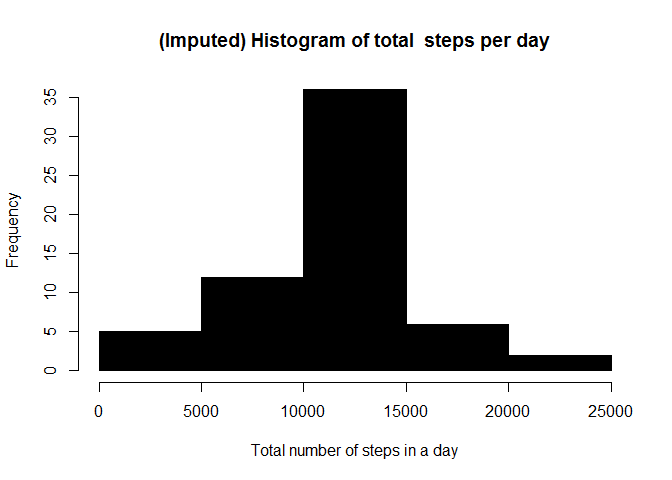

# Reproducible Research: Peer Assessment 1


## Loading and preprocessing the data


```r
temp <- read.csv("./activity.csv")

tep <- na.omit(temp)
```


## What is mean total number of steps taken per day?


```r
stepsum <- aggregate(steps ~ date, data = tep, FUN = sum , na.rm = T, na.action = na.pass)
hist(x = stepsum$steps , xlab =  "Steps each day" , breaks = 30)
```

 

```r
mean1 <- mean(stepsum$steps)
median1 <- median(stepsum$steps)

mean1
```

```
## [1] 10766.19
```

```r
median1
```

```
## [1] 10765
```


## What is the average daily activity pattern?


```r
temp2 <- aggregate(steps ~ interval , temp, FUN = mean)
plot(temp2$interval, temp2$steps, type='l', col=1, 
     main="Average number of steps averaged over all days", xlab="Interval", 
     ylab="Average number of steps")
```

 

```r
max_steps <- which.max(temp2$steps)
temp2[max_steps,]
```

```
##     interval    steps
## 104      835 206.1698
```


## Imputing missing values


```r
temp_na <- temp[!complete.cases(temp),]
nrow(temp_na)
```

```
## [1] 2304
```

```r
for (i in 1:nrow(temp)){
  if (is.na(temp$steps[i])){
    val <- temp$interval[i]
    row_id <- which(temp2$interval == val)
    steps_val <- temp2$steps[row_id]
    temp$steps[i] <- steps_val
  }
}
temp3 <- aggregate(steps ~ date, temp, sum)

hist(temp3$steps, col=1, main="(Imputed) Histogram of total  steps per day", xlab="Total number of steps in a day")
```

 

```r
mean(temp3$steps)
```

```
## [1] 10766.19
```

```r
median(temp3$steps)
```

```
## [1] 10766.19
```

```r
mean(stepsum$steps)
```

```
## [1] 10766.19
```

```r
median(stepsum$steps)
```

```
## [1] 10765
```


## Are there differences in activity patterns between weekdays and weekends?


```r
temp$date <- as.Date(temp$date, "%Y-%m-%d")
temp$day <- weekdays(temp$date)
temp$dayType <- c("weekday")

for (i in 1:nrow(temp)){
    if(temp$day[i] == "Saturday"|| temp$day[i] == "Sunday")
        {
        temp$dayType <- "weekend"
        }
}
temp$dayType <- as.factor(temp$dayType)

temp4 <- aggregate(steps ~ interval +dayType , temp,mean)
library(ggplot2)
```

```
## Warning: package 'ggplot2' was built under R version 3.1.3
```

```r
qplot(interval, steps, data=temp4, geom=c("line"), xlab="Interval", 
      ylab="Number of steps", main="") + facet_wrap(~ dayType, ncol=1)
```

 

```r
rm(temp, temp2, temp3, temp4, stepsum)
```


